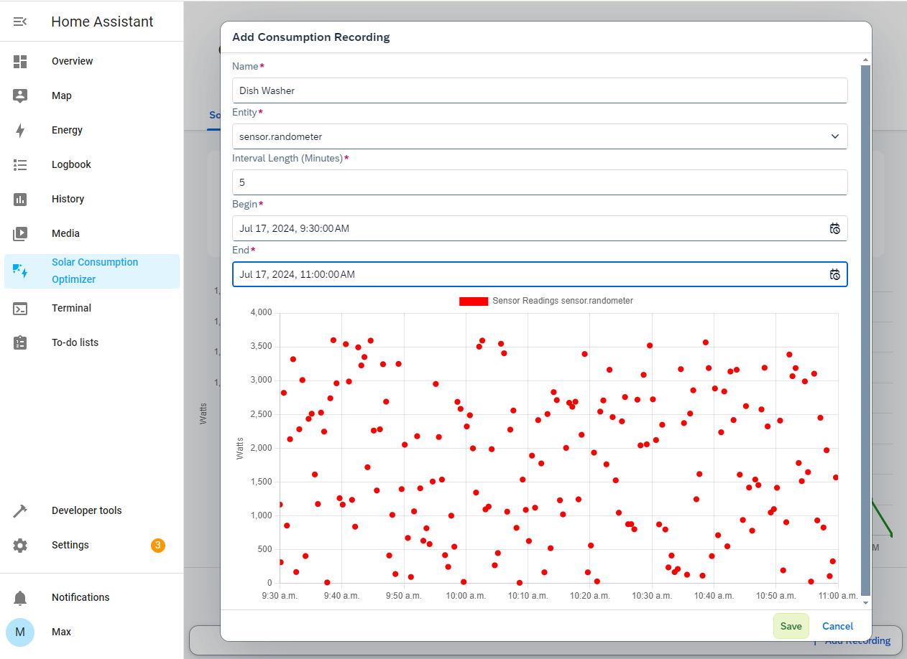

# Solar Power Consumption Optimizer
*A project of the Smart-Grids seminar at the University of Hagen.*

## Overview
This is an addon to the [Home Assistant][ha homepage] smart home system aiding private ownsers of photovoltaic installations in increasing the direct consumption of solar energy production. The addon combines realtime solar forecast data and historic energy consumption data stored in Home Assistant to make suggestions when to activate controllable electrical consumers such as laundry machines and dish washers.

[ha homepage]: <(https://www.home-assistant.io/>

## Installation
Install this addon via the Home Assistant UI by adding the repository to the Home Assistant repository list. Note that a Home Assistant OS or supervised installation is required to install addons to Home Assistant. Find more information in the [Home Assistant addon guide][ha addon guide].

From the Home Assistant UI go to Settings -> Addons -> Addon Store and add the repository URL.

Refresh the page, scroll to the bottom of the addon list and find the Solar Consumption Optimizer addon.

This addon does not come with a pre build docker container image. Instead the Home Assistant supervisor will create an image and fire up the container itself. Check addon configuration and enable the *show in sidebar* feature to quickly access the addons UI.

[ha addon guide]: <https://www.home-assistant.io/addons/>

## Solar Forecast
The addon reads solar forecast data from the [forecast.solar service][solar forecast service]. Forecast data is based on data provided by the [Photovoltaic Geographical Information System (PVGIS)][pvgis] and historic weather data.

[solar forecast service]: <https://doc.forecast.solar/>
[pvgis]: <https://joint-research-centre.ec.europa.eu/photovoltaic-geographical-information-system-pvgis_en>

Information about the photovoltaic installation such as the size, position and orientation can be configured in the addon settings within the Home Assistant UI. It is then used to obtain solar forecast data from the service.

## Consumption Recording
With the consumption recording feature, one can store the power consumption characteristic of an electrical device for later use. This is particularly designed for devices that have an (almost) identical load every time they operate, such as a dishwasher running a predefined program. To create a recording, power readings of a device must be present within home assistant. 

There are numerous ways to record electrical loads with Home Assistant, for example the [Athom Smart Plug EU V3][athom plug esp home] which features an ESP32 pre flashed with the [ESP Home][esp home] firmware making the Home Assistant integration very easy.

[athom plug esp home]: <https://devices.esphome.io/devices/Athom-Smart-Plug-PG01V3-EU16A>
[esp home]: <https://esphome.io/>

A recording is created by selecting the Home Assistant entity that represents electrical loads of the desired device, a time frame in which the device operated and the interval length. The addon obtains sensor readings from Home Assistant and stores load characteristics in form of intervals with a fixed length and constant power consumption. The average value of all sensor readings / entity states within an interval is calculated.

The addon stores recordings fore later use. Selecting a recording shows solar energy coverage predictions within the solar forecast horizon.

## Solar Energy Coverage Prediction
Solar forecast data is combined with a power consumption characteristic (recording) to make predictions when to ideally operate the device in future. In other words, when the photovoltaic installation can cover power demands of that device best. By default, the addon calculates predictions spaced by 120 minutes and shows a top 10 list.

